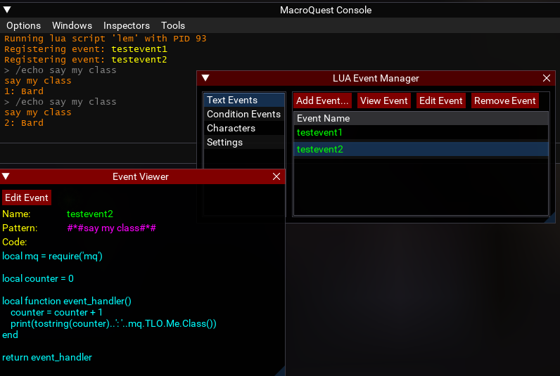

# Lua Event Manager

> This is a WIP

A script to manage event handlers for text based events (like mq2events) and condition based events (like mq2react).

# Overview

Lua Event Manager is intended to provide an alternative to `mq2events`, `mq2react` and one-off lua scripts being written for events.  

Rather than events with giant, difficult to read macro if statements, proper lua functions can be written to handle events instead.  

Rather than reacts with a YAML file that frequently gets corrupted or breaks from indentation mistakes, more complex conditions and actions can be implemented.

Event definitions are global and stored in a shared `lem/settings.lua` file. Editing events from multiple characters can overwrite changes if you aren't reloading before making edits on a character.  
Event enabled/disabled state is stored per character in a characters own `lem/characters/{name}.lua` file. Hopefully this allows to more safely enable or disable events across characters.

# Installation

Download the contents to your MQ Lua folder.

# Usage

Start the script with: `/lua run lem`

## Adding Text Events

1. Select `Text Events` and click `Add Event...`.
2. Enter a name for the new event.
3. Enter a pattern for the new event. The pattern can include `#*#` for wildcard matches or `#1#` for named matches. Named matches will be passed as arguments to the event handler function.
4. Implement the handler function for the new event. Template code is provided, including a function `event_handler`. The function arguments should be updated to match the number of arguments matched in the event pattern. The first argument to the event handler is always the complete line which matched the pattern.

## Adding Condition Events

1. Select `Condition Events` and click `Add Event...`.
2. Enter a name for the new event.
3. Implement the `condition` and `action` functions for the new event. The condition function should return a boolean value, `true` or `false`.

## Editing Event Code

All event implementations are saved to individual lua files in `/lua/lem/events` or `/lua/lem/conditions`. Editing the code in something like Visual Studio Code is probably still going to be easier than editing within an ImGui window.

